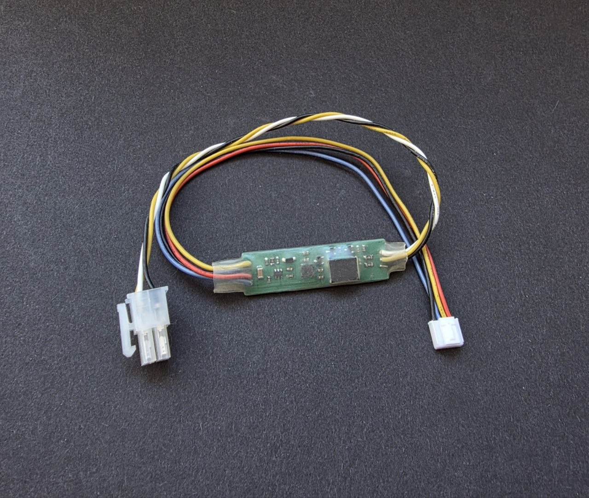

## Описание:

### Версии платы:

Существует две аппаратные версии интегратора:

- **v1** - оригинальная плата, показана выше.
- **v2** - обновленная плата, показана ниже.

Обе версии имеют одинаковую функциональность. Шаги 1–3 установки совпадают; подключение питания аккумулятора отличается (см. раздел «Установка»).

Интегратор - устройство позволяющее подключить JBD BMS к  контроллеру самокатов Ninebot серии G3 \ ZT3 \ F3 \ GT3 \ GT3 Pro. 
Ключевые особенности :
1. Полный Plug & play, нет необходимости прошивки контроллера или бмс
2. Поддерживаемые приложения Segway mobility, Powernine, Xiaodash
3. Полная проекция информации о батарее : ток, температура, напряжения, втч побаночные
4. Таймеры экстремального использования.
5. Режим сна для минимизации энергопотребления
6. Подключение аккумуляторов до 16s (17s 18s 19s... 22s необходима модификация MCU, подробности ниже)
7. Функция отображения режима зарядки
8. Поддержка OTA обновлений

| **Модель**                  | **Совместимость** |                                            Комментарий                                            |
| --------------------------- | :---------------: | :-----------------------------------------------------------------------------------------------: |
| Ninebot ZT3 Pro             |         ✅         |                    >13s резистор, > 16s глубокая переработка платы. Лимит 20s                     |
| Ninebot G3                  |         ✅         |                    >13s резистор, > 16s глубокая переработка платы. Лимит 20s                     |
| Ninebot GT3                 |         ✅         |                    >13s резистор, > 16s глубокая переработка платы. Лимит 20s                     |
| Ninebot GT3 Pro             |         ✅         |                                          20s из коробки                                           |
| Ninebot G30 / G2            |         ❌         | [Для этой модели используется другой интегратор](https://github.com/truesurge/Legacy-integrator/) |
| Ninebot GT1 / GT2           |         ❌         | [Для этой модели используется другой интегратор](https://github.com/truesurge/Legacy-integrator/) |
| Другой не указаный  Ninebot |         ❌         | [Для этой модели используется другой интегратор](https://github.com/truesurge/Legacy-integrator/) |

⚠️ WARNING: Для повышения напряжения, необходимо заменить резистор внутри MCU соответствующий вашему напряжению из списка ниже. Допустимо устанавливать номинал +5%

Типоразмер SMD 0603

| Конфигурация    | Сопротивление | P.S.                                                                                                                                  |
| --------------- | ------------- | ------------------------------------------------------------------------------------------------------------------------------------- |
| 13s             | 200k          |                                                                                                                                       |
| 14s             | 215k          |                                                                                                                                       |
| 15s             | 230k          |                                                                                                                                       |
| 16s             | 246k          |                                                                                                                                       |
| 17s             | 260k          | Опасно. Напряжение близко к пределам мосфетов. Вы можете сжечь их. Будьте осторожны или просто замените его совместно с кондесаторами |
| 18s             | 276k          | Опасно. Напряжение близко к пределам мосфетов. Вы можете сжечь их. Будьте осторожны или просто замените его совместно с кондесаторами |
| 19s 20s 21s 22s |               | Опасно. Напряжение близко к пределам мосфетов. Вы можете сжечь их. Будьте осторожны или просто замените его совместно с кондесаторами |

## Установка:

<table>
  <thead>
    <tr>
      <th></th>
      <th></th>
    </tr>
  </thead>
  <tbody>
    <tr>
      <td colspan="2">⚠️ Отключите мосфеты заряда/разряда в приложении. ⚠️ </td>
    </tr>
    <tr>
      <td colspan="2">Подключите интегратор к BMS: 4-контактный разъём → порт UART.</td>
    </tr>
    <tr>
      <td colspan="2">Подключите интегратор к MCU: 4-контактный разъём Molex minifit.</td>
    </tr>
    <tr>
      <td>Подключите интегратор к MCU разъёмом XT90.</td>
      <td>Подключите аккумулятор напрямую к MCU. На плате v2 нет разъёма XT90.</td>
    </tr>
    <tr>
      <td>Подключите аккумулятор к интегратору разъёмом XT90.</td>
      <td>Включите мосфеты заряда/разряда в приложении.</td>
    </tr>
    <tr>
      <td>Включите мосфеты заряда/разряда в приложении.</td>
      <td>—</td>
    </tr>
  </tbody>
</table>

Отключение — ⚠️ в обратном порядке ⚠️

## Заказ и поддержка

Россия - https://t.me/SurgeSPB
Беларусь / Европа - https://shop.jsb.by
Поддержка - https://t.me/ninebotfun

## Полезности:

1) Если вы используете электро-тормоз, рекомендуется выставить в максимальный возможный для вашей BMS лимит по перенапряжению и максимальному току в настройках BMS. Во время торможения ток перетекает в аккумулятор и напряжение\ток может быть выше номинальных значений, особенно если аккумулятор заряжен на 100%. Если этого не сделать BMS может уйти в защиту, из за чего току будет некуда деваться кроме как остаться где-то в контроллере, что вызовет его поломку. Так же рекомендуется не заряжать аккумулятор до 100%, тем самым вы продлите срок жизни самого аккумулятора и оставите свободное место для излишек тока во время торможения. Это тоже самое если бы вы в бутылку пытались налить воды больше чем её объём.
2) В репозитории есть папка с прошивками https://github.com/truesurge/integrator/tree/main/updates Для прошивки используйте https://utility-beta.cfw.sh/